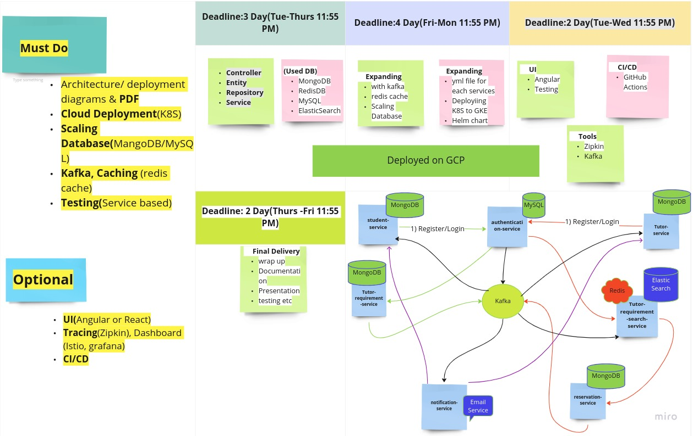

### Mind Map



## #How to run?

### _Development:_

1. Running Single Service at a time:
    - _If Using IDE_:Run each services by clicking their "run" icon
    - _Using only CMD_ : On terminal of specific service, type 'mvn spring-boot:run'
    - _JAR file_: First, Create jar 'mvn clean install' and run 'java -jar target/service1.jar'

2. Running the application using docker
    - If cloned first time, In the root directory run 'mvn clean install' or use IDE, maven -> install (to create jar
      for all services)
    - Then, In terminal type: 'docker compose up'. (this will run mysql, and other services)

    ```cmd
   mvn clean install -DskipTests
   docker compose up
   ```

> Check docs/dev folder README, to start the required services. "MongoDB", "Kafka", "Redis" ..

### _Deployment K8S:_

```cmd
mvn clean install -DskipTests

#If minikube, also run -> minikube docker-env
docker compose build 

# cores: All configs and DB, services: all services
kubectl create -f k8s/cores
kubectl create -f services

# add "192.168.49.2 add new things " to /etc/host
sudo nano /etc/hosts

======================================================================
127.0.0.1  localhost
192.168.49.2 //TODO
======================================================================
```

### _Testing Deployed Services_

```
# FROM: "authentication-service", This is for create user

curl --location --request POST 'http://localhost:8080/users/register' \
--header 'Content-type:application/json' \
--data-raw 
- Student Registration
            '{
                "username": "student@gmail.com",
                "password": "pass",
                "role": "ROLE_STUDENT",
                "fullName": "StudentName",
                "address": "1000 N",
                "phone": "12345",
                "description": "I am a student"
            }'

-Tutor Registration
            '{
                "username": "tutor@gmail.com",
                "password": "pass",
                "role": "ROLE_TUTOR",
                "fullName": "TutorName",
                "address": "1000 N",
                "phone": "12345",
                "description": "I am a tutor",
                "expertise": "Java",
                "shortInfo": "I am experts."
            }'

# FROM: "authentication-service", This is for Login


curl --location --request POST 'http://localhost:8080/users' \
--header 'Content-type:application/json' \
--data-raw 
-Student Login
               '{
                   "username": "student@gmail.com",
                   "password": "pass"
               }'

-Tutor Login
               '{
                   "username": "tutor@gmail.com",
                   "password": "pass"
               }'

# From: "tutor-requirement-service", This for creating tutor Requirements for Students
--header 'Content-type:application/json' \
--data-raw 
               '{
                   "title": "Physics Teacher",
                   "description": "I am looking for tutor who can teach physics."
               }'


# From: "reservation-service", This for creating Reservation for Students
--header 'Content-type:application/json' \
--data-raw
Note: After searching tutor requirement the tutor will send requst to student by clicking send request button from UI.       
```


## # How to create this project, and how to add new modules/services?

_Steps: Creating multi-module project_

1. Create new project "swa-final-project", and select buildSystem maven.
2. then either Create new services or Add existing ones
    - _Create (New Module):_ right click on "swa-final-project" and create any module
        - eg click on:new -> module -> springInitializer
    - _Add(Add Module):_ right click on "swa-final-project", open module settings
        - then under that Settings -> Modules -> click on+ -> import module -> Select .pom file or directory ->then
          import module from external model-> select maven -> Apply
    - After that go to pom.xml of root project "swa-final-project" and add to `<modules>...<modules>`

## # How to contribute to the project ?

_INSTRUCTION:_

1. Use _"develop"_ branch to make and commit changes.
2. We will merge to __"main"__ on the day-end or when services are integrated and working fine.

> _Want to know, what to contribute and how to do it ?_

---

## # Need Further help ?

_Reach out team-mates to Discuss and do it together._

## Team Member

- _PRADIP DHUNGEL_
- _RAJIV GYAWALI_
- _VISHWA DEEP GHIMIRE_
- _ESMELEALEM MIHRETU ESEYNEEH_
